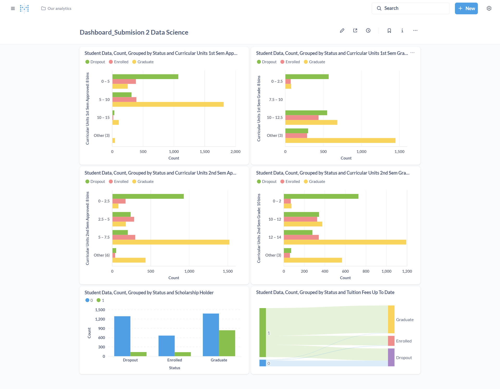

# Proyek Akhir: Menyelesaikan Permasalahan Perusahaan Edutech

## Business Understanding
Jaya Jaya Institut adalah salah satu institusi pendidikan perguruan yang telah beroperasi sejak tahun 2000. Selama lebih dari dua dekade, institusi ini telah berhasil mencetak banyak lulusan berkualitas dengan reputasi yang sangat baik di dunia kerja dan pendidikan lanjutan. Namun, di tengah pencapaian tersebut, Jaya Jaya Institut juga menghadapi tantangan berupa tingginya angka siswa yang tidak menyelesaikan pendidikannya atau dropout. Tingginya tingkat dropout ini menjadi masalah serius karena dapat mempengaruhi reputasi institusi, mengurangi jumlah lulusan, serta berdampak pada kepercayaan masyarakat terhadap kualitas pendidikan yang diberikan. Oleh karena itu, institusi ini berupaya untuk mendeteksi secara dini siswa yang berisiko dropout agar dapat memberikan bimbingan dan dukungan khusus, sehingga setiap siswa berpeluang lebih besar untuk menyelesaikan pendidikan dan meraih kesuksesan di masa depan.

### Permasalahan Bisnis
* Deteksi Dini Siswa Berisiko Dropout:
Institusi ingin mengidentifikasi secara cepat dan akurat siswa-siswa yang berpotensi tidak menyelesaikan pendidikan mereka, sehingga dapat diberikan intervensi atau bimbingan khusus sebelum terlambat.

* Monitoring Performa Siswa:
Institusi membutuhkan cara untuk memantau performa dan perkembangan siswa secara visual dan mudah dipahami, agar pihak manajemen dan pengajar dapat mengambil keputusan berbasis data.

### Cakupan Proyek
* Machine Learning di Streamlit:
Dengan membangun aplikasi berbasis Streamlit, Jaya Jaya Institut dapat mengimplementasikan model machine learning untuk memprediksi siswa mana yang berisiko dropout berdasarkan data historis dan fitur-fitur tertentu. Aplikasi ini dapat digunakan oleh staf pengajar atau manajemen untuk memasukkan data siswa dan langsung mendapatkan prediksi serta rekomendasi.

* Business Dashboard di Metabase:
Metabase digunakan untuk membuat dashboard yang menampilkan berbagai metrik performa siswa secara visual, seperti tingkat kehadiran, nilai, dan indikator risiko dropout. Dashboard ini memudahkan monitoring dan analisis data secara real-time, sehingga manajemen dapat mengambil tindakan preventif lebih cepat.

### Persiapan

Sumber data: sumber data yang digunakan didapatkan dari link berikut [dataset jaya-jaya institute](https://github.com/dicodingacademy/dicoding_dataset/blob/main/students_performance/README.md). Dataset tersebut berisi berbagai data terkait siswa seperti metode pendaftaran, nilai setiap semester, sks yang diambil, apakah membayar biaya pendidikan tepat waktu,dll

Setup environment:
Setup environment:
* Setup Environment menggunakan Anaconda:
conda create --name main-ds python=3.9
conda activate main-ds
pip install -r requirements.txt
* Setup Environment menggunakan Shell/Terminal:
pip install pipenv
pipenv install
pipenv shell
pip install -r requirements.txt
* Libraries tambahan yang digunakan: Pandas, Numpy ,Seaborn, Matplotlib,SQLAlchemy,dython(info lebih lanjut bisa melihat file requirement.txt)
* tools yang digunakan: Pythone,Notebook, Supabase, Metabase


## Business Dashboard
Dashboard yang telah dibuat dirancang untuk menunjukkan faktor yang paling berpengaruh terhadap Dropout. Faktor yang dipilih adalah jumlah SKS yang diambil pada semester 1 dan 2, nilai pada semester 1 dan 2, ketetapan membayar biaya pendidikan, dan kepemilikan scholarship.


Berikut pengaruh faktor tersebut terhadap kemungkinan dropout:
* Semakin sedikit SKS yang diambil pada semester 1 dan 2 semakin besar kemungkinan siswa mengalami dropout
* Semakin rendah nilai siswa pada semester 1 dan 2 semakin besar kemungkinan dropout siswa
* Siswa yang tidak memiliki beasiswa semakin besar kemungkinannya untuk dropout
* Siswa yang telat membayar biaya pendidikan lebih besar kemungkinannya Dropout


### Kredensial Dashboard:
Gunakan kredensial berikut untuk mengakses dashboard
* Username: root@mail.com  
* Password: root123


## Menjalankan Sistem Machine Learning
Jelaskan cara menjalankan protoype sistem machine learning yang telah dibuat. Selain itu, sertakan juga link untuk mengakses prototype tersebut.

```

```

## Conclusion
Jelaskan konklusi dari proyek yang dikerjakan.

### Rekomendasi Action Items
Berikan beberapa rekomendasi action items yang harus dilakukan perusahaan guna menyelesaikan permasalahan atau mencapai target mereka.
- action item 1
- action item 2
